# 面向建筑行业资料的电商式展示系统设计
摘要：  
在数字化转型背景下，建筑行业对高效获取专业资料的需求日益迫切。传统资料获取方式存在分散、滞后、检索困难等痛点，严重制约项目进度与质量。本文提出并设计了一套面向建筑行业资料的电商式展示系统，借鉴电商平台“分类清晰、检索精准、交互友好”的优势，将建筑规范、图纸、案例等资料进行统一数字化管理与可视化呈现。系统基于Vue3+Element Plus技术栈，采用B/S架构与JSON数据格式，实现了首页轮播、网格/列表展示、搜索筛选、收藏管理、响应式布局等核心功能。借助本地存储实现收藏状态持久化，为建筑从业者节省约40%的资料搜集时间。实践表明，该系统有效打通行业资料流通壁垒，为建筑行业知识共享与协同创新提供了低成本、可扩展的数字化解决方案。

关键词：建筑资料；电商式展示；Vue3；JSON；响应式；搜索筛选；收藏管理

# 1 绪论

## 1.1 研究背景和意义

在建筑行业快速发展的背景下，设计资料的高效获取成为影响项目进度的关键因素。建筑项目从方案设计到施工落地，需依赖大量规范标准、案例图纸、技术参数等专业资料，这些资料的准确性与获取效率直接关系到工程质量与推进速度。然而，当前行业资料存在分散存储、检索困难、更新滞后等问题，传统获取方式难以满足快节奏工作需求，导致设计师在资料搜集上耗费过多时间成本。

本课题设计的建筑行业资料电商式展示系统，旨在借鉴电商平台的高效展示与交互逻辑，整合建筑行业资料资源。通过规范化分类、可视化展示和精准检索功能，实现资料的快速匹配与获取，既解决行业资料流通不畅的痛点，又为建筑从业者节省时间成本；同时，系统开发过程中采用 Vue 框架与 JSON 数据管理技术，为前端开发实践提供参考案例，兼具行业应用价值与技术探索意义。

随着数字化转型浪潮席卷全球，建筑行业正经历着从传统模式向数字驱动模式的深刻变革。在这一背景下，如何构建高效、便捷的资料获取渠道，成为提升行业整体效率的关键环节。电商式展示系统的引入，不仅能够优化资料流通机制，还能促进行业知识共享与技术创新，为建筑行业的可持续发展注入新动能。

## 1.2 国内外研究现状

国外建筑行业信息化起步较早，已形成如 ArchiCAD、Autodesk 等集成化平台，侧重资料与设计工具的绑定，但多以软件内置库形式存在，缺乏独立的电商式展示交互体验。这些平台虽然功能强大，但通常采用封闭生态系统，资料获取渠道受限，且价格较高，限制了中小型企业的使用。

国内建筑资料平台多以论坛、数据库形式存在，如筑龙网、土木在线网等，侧重资料下载功能，但存在分类混乱、冗余信息多等问题，且未形成类似电商平台的精准筛选与个性化推荐机制。随着数字化转型推进，行业对资料展示的便捷性、交互性要求提升，但现有平台尚未实现电商模式与专业资料的深度融合，本系统的设计可填补这一空白。

近年来，随着 Vue、React 等前端框架的兴起，Web 应用的用户体验得到显著提升。然而，将这些现代化前端技术应用于建筑行业资料展示的研究相对较少。电商平台的成功经验表明，良好的用户界面设计、精准的搜索推荐机制和便捷的交互体验，能够显著提升用户满意度和使用效率。将这些成熟经验迁移到建筑行业资料展示中，具有重要的理论价值和实践意义。

与此同时，行业标准化的推进也为资料的结构化管理提供了基础。BIM（建筑信息模型）技术的普及，使得建筑信息的数字化表达更加规范和丰富，为电商式展示系统的内容组织提供了数据基础。在此背景下，研究如何构建符合行业特点、满足用户需求的资料展示系统，成为当前亟待解决的问题。

## 1.3 本文主要工作

本课题聚焦建筑行业资料的电商式展示需求，核心工作围绕系统设计与实现展开：

（1）分析建筑行业资料的类型特征及用户检索习惯，明确系统功能需求；

（2）设计基于 Vue 框架的响应式界面，包含资料展示网格、轮播组件、分类导航等模块，模拟电商平台的直观交互体验；

（3）开发资料分类、关键词搜索、条件筛选等核心功能，实现多维度资料检索；

（4）采用 JSON 数据格式存储资料信息，设计合理的数据结构支持资料详情展示与动态更新。

## 1.4 论文结构

本文围绕建筑行业资料电商式展示系统的设计与实现展开，章节安排如下：

第一章：绪论，阐述研究背景、意义及国内外现状，明确课题核心目标；

第二章：介绍系统开发所用技术，包括 Vue 框架、JSON 数据存储及响应式设计原理，说明开发环境配置；

第三章：进行系统需求分析与总体设计，通过用例分析明确功能模块，规划系统架构；

第四章：详细设计系统各模块，包括界面组件设计、数据库（JSON 结构）设计及核心功能实现逻辑；

第五章：描述系统实现过程，展示关键功能代码与运行效果，并通过测试用例验证系统性能；

第六章：结论与展望，归纳研究成果，分析系统不足并提出优化方向。


# 2 相关技术与开发环境

## 2.1 相关技术

### 2.1.1 B/S模式

B/S（Browser/Server）模式是一种基于浏览器的网络应用架构，用户通过Web浏览器即可访问服务器上的应用程序，无需安装专门的客户端软件。本系统采用B/S模式设计，具有以下优势：首先，客户端维护成本低，用户只需使用浏览器即可访问系统；其次，系统更新和维护集中在服务器端，提高了开发和运维效率；最后，B/S模式支持跨平台访问，用户可以在不同操作系统和设备上使用相同的功能。

### 2.1.2 ES模块语法

ES模块是JavaScript的官方模块系统，通过import/export语句实现模块间的代码共享。在本系统开发中，ES模块语法的应用使得代码结构更加清晰，模块职责更加单一，便于代码的维护和测试。使用import语句可以按需加载所需模块，减少不必要的代码加载，提高应用性能。同时，export语句支持命名导出和默认导出两种方式，灵活满足不同的模块导出需求。

### 2.1.3 HTML5与CSS

HTML5是最新的HTML标准，提供了丰富的语义化标签和新特性，如Canvas、Web Storage、WebSocket等，为Web应用提供了更强大的功能支持。在本系统中，HTML5的语义化标签（如header、nav、main、section等）被用于构建清晰的页面结构，提高代码的可读性和可维护性。

CSS的许多特性，如圆角、阴影、渐变、动画等，使得页面样式更加丰富和生动。本系统使用CSS的响应式设计特性（如媒体查询、弹性布局、网格布局），确保系统在不同设备上都能提供良好的用户体验。同时，CSS的动画效果被用于提升用户交互体验，如页面切换时的过渡效果、元素的悬停效果等。

### 2.1.4 Vue3

Vue3是一个用于构建用户界面的渐进式JavaScript框架，具有响应式数据绑定、组件化开发、虚拟DOM等特性。在本系统开发中，Vue3的组合式API（Composition API）被广泛应用，使得逻辑复用更加灵活，代码结构更加清晰。Vue3的响应式系统基于Proxy实现，相比Vue 2的Object.defineProperty，具有更好的性能和更完整的响应式支持。

Vue3的主要优势：更好的性能：虚拟DOM的优化、编译时的静态提升等；更小的体积：Tree-shaking友好，减少打包后的代码体积；更灵活的组合式API：便于逻辑复用和代码组织；更好的TypeScript支持：提供完整的类型定义。

### 2.1.5 JSON数据格式

JSON（JavaScript Object Notation）是一种轻量级的数据交换格式，易于人阅读和编写，也易于机器解析和生成。在本系统中，JSON被广泛应用于存储和传输课程数据、用户收藏信息、搜索条件配置等多种场景。特别是在前后端数据交互过程中，JSON作为数据载体确保了信息传输的高效性和准确性。

JSON数据格式具有以下特点：基于JavaScript对象语法，与Vue3框架完美集成，无需复杂的类型转换；轻量级，传输效率高，减少了网络传输负担；支持嵌套结构，可以灵活表示课程与章节、用户与收藏等复杂的数据关系；跨语言支持，几乎所有编程语言都有JSON解析库，为未来系统扩展提供了便利；此外，JSON还支持数组和对象的组合使用，使系统能够更加灵活地处理和展示建筑行业相关的结构化资料数据。

### 2.1.6 Element Plus库

Element Plus是一套基于Vue3的桌面端组件库，提供了丰富的UI组件，如按钮、表单、对话框、表格等，以及完善的文档和示例。在本面向建筑行业资料的电商式展示系统中，Element Plus组件库发挥着核心作用，不仅用于快速构建界面，更重要的是确保了用户界面的专业性和一致性，极大地提高了开发效率。

Element Plus的主要特性包括，覆盖常见的UI需求、支持自定义主题颜色、提供多语言切换、适配不同屏幕尺寸、TypeScript的支持，提供类型定义，增强开发体验。此外，Element Plus还具备良好的可扩展性，允许开发者通过组件的二次封装来满足建筑行业特定的展示需求，如复杂的建筑资料分类展示、详细参数表格等。其组件的响应式设计确保了系统在不同设备上都能提供良好的用户体验，而丰富的表单组件则为用户提供了便捷的搜索和筛选功能，有效提升了建筑资料的检索效率。同时，Element Plus的性能优化设计也确保了系统在加载大量建筑资料数据时依然保持流畅的运行体验。

## 2.2 开发环境

### 2.2.1 硬件环境

Window11系统的笔记本/Window10系统的台式电脑

处理器：英特尔 i7-12700H 2.3 GHz

内存大小：8GB或以上

硬盘大小：C盘(185.0GB)、E盘(50.0GB)

显示器：分辨率1920x1080或以上

### 2.2.2 软件环境

操作系统：Windows 10/11

开发工具：Visual Studio Code，安装Vetue、Vue等扩展

版本控制：Git

构建工具：Node.js、npm

浏览器：Chrome、Edge

前端框架：Vue3

基于Vue3的开源UI组件库：Element Plus

路由管理：Vue Router

# 3 建筑行业资料的电商式展示系统分析

## 3.1 可行性分析

### 3.1.1 技术可行性

从技术角度分析，本系统的开发是完全可行的。首先，Vue3作为主流的前端框架，具有成熟的生态系统和丰富的开发资源，能够满足系统的响应式设计需求。Element Plus组件库提供了丰富的UI组件，可以快速构建美观、易用的界面。JSON数据格式轻量高效，适合存储和传输系统所需的数据。

其次，系统的核心功能（如图片轮播、课程展示、搜索筛选、收藏管理等）在现有技术条件下都有成熟的实现方案。Vue Router提供了完整的路由管理功能，可以实现页面的无缝切换。本地存储（localStorage）技术可以满足用户收藏数据的持久化需求。

最后，开发团队具备Vue框架和相关技术的开发经验，能够熟练运用这些技术进行系统开发。综合来看，本系统在技术上是完全可行的。

### 3.1.2 经济可行性

从用户使用角度来看，本系统是基于网页技术构建的，只要设备（电脑、手机、平板等）安装有浏览器即可访问，有效避免了不同操作系统间软件兼容性问题。同时，系统的界面设计简洁明了，操作流程直观易懂，无需复杂的配置和安装过程，极大提高了用户的使用便利性。

从开发角度来看，本系统的开发和维护成本相对较低。首先，系统使用的开发框架——Vue3和组件库———Element Plus都是开源的，不需要支付授权费用。开发工具——VS Code也是免费的，进一步降低了开发成本。

另外，系统采用B/S架构，用户只需通过浏览器即可访问，无需为每个用户安装客户端软件，降低了系统的部署和维护成本。

系统的数据存储采用JSON文件格式，这一轻量级数据交换格式具有以下特点：首先，无需配置复杂的数据库环境，简化了系统架构，降低了运维成本；其次，JSON文件具有良好的可读性，便于开发人员调试和更新数据；此外，JSON格式支持嵌套数据结构，能够灵活表达建筑行业资料的复杂关联关系，如课程与章节、资料与标签之间的层次关系；同时，JSON文件与前端JavaScript生态系统天然契合，与Vue3框架结合使用时，可实现数据的高效解析和渲染。

需要指出的是，当前JSON文件管理方式也存在一定局限性：对于大规模数据应用，手动管理多个JSON文件（当前系统需要维护20个独立的课程数据文件）会带来维护复杂度较高的问题；缺乏数据库的事务支持和查询优化能力；数据更新需要手动修改文件并重新部署。这些局限性在系统规模扩大时可能成为瓶颈，未来可考虑迁移到数据库管理系统以提升数据管理效率。

最后，从经济效益角度分析，本系统的开发具有多方面的经济价值：首先，通过电商式的资料展示和交易模式，显著提升了建筑行业资料的流通效率，减少了传统线下资料获取和交流的时间消耗，可以为建筑从业者节省资料搜索和获取的时间，降低人力成本；其次，系统支持资料的数字化管理和共享，减少了纸质资料的印刷、存储和运输成本，具有明显的资源节约效应；此外，系统的可扩展性设计使得后续功能迭代和维护成本相对较低，能够长期为企业创造价值；最后，通过提高建筑资料的利用效率，间接促进了建筑项目设计和施工的标准化、规范化，有助于减少返工和资源浪费，进一步放大了经济效益。综合上述因素，本系统不仅开发和维护成本可控，而且能够为建筑行业相关企业和从业者创造实际的经济价值，在经济上是完全可行的。

## 3.2 系统功能需求

### 3.2.1 功能需求描述

本系统旨在提供一个电商式的建筑行业资料展示平台，主要功能需求包括：

（1）首页展示：展示系统的主要内容，包括轮播图、课程、搜索栏、筛选栏、学习中心；

（2）课程列表展示：以网格形式展示课程信息，包括课程标题、封面图、标签；

（3）课程详情展示：展示课程的详细信息，包括课程介绍、章节列表；

（4）搜索功能：支持按课程标题的关键词进行搜索；

（5）筛选功能：支持按建筑行业专业分类进行筛选；

（6）收藏功能：用户可以收藏感兴趣的课程，并在学习中心查看收藏后的课程；另外，可以对收藏的课程进行取消收藏操作；

（7）课程管理：管理员可以在JSON文件中添加、编辑、删除课程信息。

### 3.2.2 系统用例介绍

系统的主要用户包括普通用户和管理员，他们的主要用例如下：

普通用户用例：

（1）浏览首页：用户访问系统首页，查看轮播图和课程列表。

（2）浏览各专业的课程列表：用户浏览系统中以网格形式展示的课程信息。

（3）查看课程详情：用户点击课程，查看课程的课程介绍、章节列表。

（4）搜索课程：用户通过关键词搜索感兴趣的课程。

（5）筛选课程：用户通过建筑行业专业分类的条件筛选课程。

（6）收藏课程：用户收藏感兴趣的课程，方便后续查看。

（7）取消收藏：用户取消对已收藏课程的收藏。

管理员用例：

（1）添加课程：管理员在JSON文件中添加新的课程信息。

（2）编辑课程：管理员修改现有课程的信息。

（3）删除课程：管理员删除不需要的课程信息。

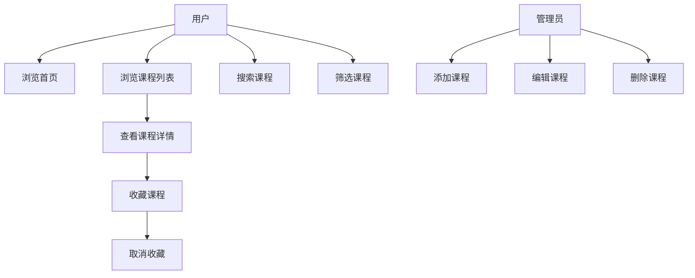

### 3.2.3 图片的轮播

图片轮播功能是系统首页的重要组成部分，用于展示建筑行业各专业的专业特性，比如建筑专业展现外立面、结构专业展现结构元素等。该功能需要实现以下需求：

（1）自动播放：图片按设定的时间间隔自动切换。

（2）手动控制：用户可以通过点击左右箭头或下方的指示器手动切换图片。

（3）响应式设计：在不同屏幕尺寸下保持良好的显示效果。

（4）图片加载优化：实现图片的懒加载，提高页面加载速度。

### 3.2.4 课程信息的显示

课程信息的显示是系统的核心功能之一，需要在不同专业的页面以网格或列表形式展示课程相关信息：

（1）课程列表：以网格形式展示多个课程，包括课程标题、封面图、标签等。

（2）课程详情：以列表形式展示课程的完整信息，包括详细介绍、章节列表等。

### 3.2.5 课程信息搜索

搜索功能是系统的重要组成部分，帮助用户快速找到所需的课程。搜索功能需要实现以下需求：

（1）关键词搜索：支持输入关键词进行搜索。

（2）搜索结果展示：在搜索结果显示匹配的课程。

（3）无结果提示：当搜索无匹配结果时，提供友好的提示信息。

（4）条件筛选功能：用户可以结合搜索关键词和筛选条件，进行更精准的课程查找。筛选条件为专业，比如建筑、结构等。

### 3.2.6 课程的收藏与取消收藏

收藏功能允许用户保存感兴趣的课程，方便后续查看和学习。该功能需要实现以下需求：

（1）收藏状态切换：用户可以一键收藏或取消收藏课程。

（2）收藏状态持久化：用户的收藏状态保存在本地存储中，页面刷新后仍能保持。

（3）收藏列表展示：在学习中心的页面展示用户收藏的所有课程。

（4）收藏课程的跳转：用户可以点击收藏的课程，跳转到课程详情页面。

### 3.2.7 课程数据管理

课程数据管理是系统的重要功能，在本系统中，课程数据以JSON文件形式存储，需要实现以下需求：

（1）数据格式规范：定义统一的JSON数据格式，确保数据的一致性和完整性；

（2）文件系统管理：通过文件系统直接管理JSON文件，确保数据的可维护性；

（3）数据验证：对课程数据进行格式和内容验证，确保数据质量；

（4）模块化加载：系统通过模块导入方式自动加载课程数据，确保数据访问的效率；

### 3.2.8 其它需求

除了上述功能需求外，系统还需要满足以下需求：

（1）界面美化：运用Element Plus库进行网页的美化，提供良好的视觉体验。

（2）响应式设计：确保系统在不同设备（桌面、平板、手机）上都能正常显示和使用。

（3）性能优化：优化页面加载速度和交互响应时间，提供流畅的用户体验。

（4）错误处理：对可能出现的错误进行友好的提示和处理，避免用户体验受到影响。

（5）用户体验：提供直观、易用的界面，减少用户的学习成本。

## 3.3 本章小结

本章对建筑行业资料电商式展示系统进行了全面的需求分析。首先进行了可行性分析，从技术和经济两个角度论证了系统开发的可行性。然后详细分析了系统的功能需求，包括首页展示、课程列表展示、课程详情展示、搜索功能、筛选功能、收藏功能和课程管理等。同时，还分析了系统的非功能需求，如界面美化、响应式设计、性能优化等。

通过本章的分析，明确了系统的功能边界和技术路线，为后续的系统设计和实现提供了基础。

# 4 系统设计

## 4.1 系统架构设计

本系统基于Vue3框架开发，使用Vue Router进行路由管理，Element Plus提供UI组件支持。系统的整体架构分为三个层次：界面层、业务逻辑层和数据层。

（1）界面层：负责用户界面的展示和用户交互，由Vue组件构成。主要包括首页组件、课程列表组件、课程详情组件、收藏页面组件等。界面层通过Vue的响应式系统与业务逻辑层进行数据交互。

（2）业务逻辑层：负责处理系统的核心业务逻辑，包括数据获取、数据处理、状态管理等。业务逻辑层通过JavaScript模块导入的方式直接读取JSON格式的课程数据，并将处理后的数据传递给界面层。

（3）数据层：负责数据的存储和提供，在本系统中主要以JSON文件形式存储课程数据，通过JavaScript模块导入方式直接获取数据。用户的收藏数据存储在浏览器的localStorage中。

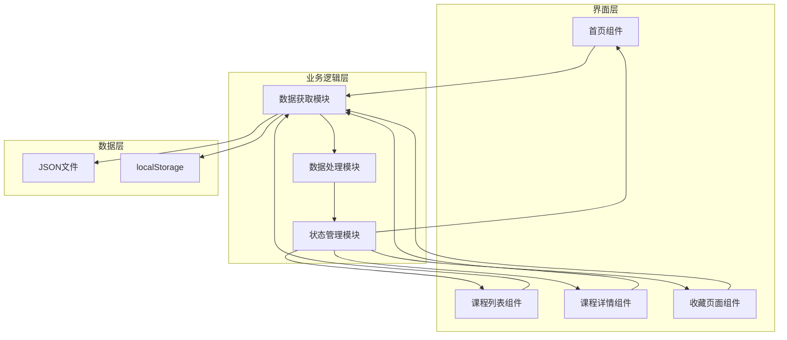

## 4.2 页面结构设计

系统的页面结构主要包括以下几个部分：

（一）顶部导航栏：固定在页面顶部，包含系统Logo和主要导航链接（首页、学习中心）。导航栏采用响应式设计，在小屏幕设备上自动调整布局。

（二）主内容区域：根据当前路由显示不同的页面内容，包括：

（1）首页：展示轮播图、热门课程、推荐课程等内容。

（2）学习页面：展示用户收藏的课程列表，支持课程管理操作。

（3）课程详情页：展示课程的详细信息，包括课程介绍、章节列表等。

页面结构的设计遵循响应式原则，确保在不同屏幕尺寸下都能提供良好的用户体验。在大屏幕设备上，采用多列布局展示内容；在小屏幕设备上，自动调整为单列布局。

## 4.3 组件设计

系统的主要组件设计如下：

（1）App组件：系统的根组件，负责整体布局和路由管理。包含顶部导航栏、主内容区域。

（2）Home组件：首页组件，展示轮播图和课程。内部包含轮播图组件、课程卡片组件等子组件。

（3）Learn组件：学习页面组件，展示用户收藏的课程列表。内部包含课程列表组件、收藏管理组件等子组件。

（4）CourseDetail组件：课程详情组件，展示课程的详细信息。内部包含课程信息展示组件、章节列表组件等子组件。

（5）轮播图组件：用于展示图片轮播，支持自动播放和手动控制。

（6）课程卡片组件：用于展示课程概览信息，包含课程封面、标题、标签等。

（7）搜索组件：提供搜索输入框和搜索按钮，支持关键词搜索。

（8）筛选组件：提供分类、标签等筛选条件，支持多条件组合筛选。

（9）收藏按钮组件：用于收藏或取消收藏课程，显示当前收藏状态。

## 4.4 数据模型设计

系统的数据模型主要包括课程数据和用户收藏数据。

### 4.4.1 课程数据模型

课程数据采用层次化结构设计，包含课程基本信息、章节内容和元数据。以下是课程数据的可视化结构：

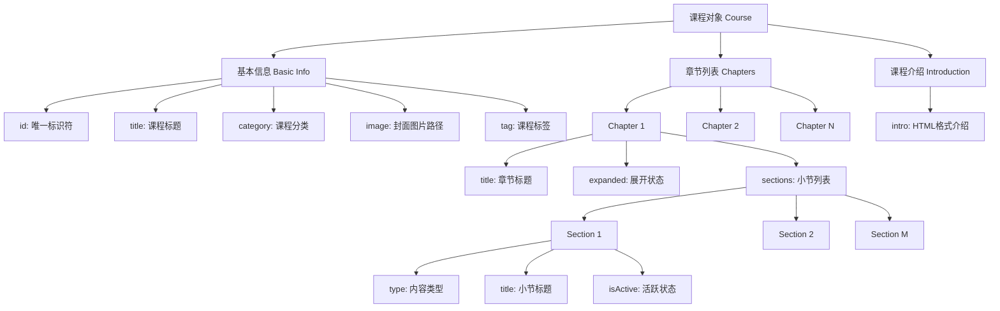

#### 课程数据结构详细说明

| 字段名称 | 数据类型 | 说明 | 示例值 |
|---------|---------|------|--------|
| **id** | String | 课程唯一标识符 | "1_1" |
| **title** | String | 课程标题 | "建筑设计从入门到精通" |
| **category** | String | 课程分类 | "建筑设计" |
| **image** | String | 课程封面图片路径 | "/images/index/建筑设计推广1.jpg" |
| **tag** | String | 课程标签 | "基础入门" |
| **chapters** | Array | 课程章节列表 | 见下表 |
| **intro** | String | 课程介绍（HTML格式） | "<p>本课程涵盖...</p>" |

#### 章节数据结构

| 字段名称 | 数据类型 | 说明 | 示例值 |
|---------|---------|------|--------|
| **title** | String | 章节标题 | "第一章：建筑设计基础" |
| **expanded** | Boolean | 章节是否展开 | true/false |
| **sections** | Array | 章节内容列表 | 见下表 |

#### 小节数据结构

| 字段名称 | 数据类型 | 说明 | 示例值 |
|---------|---------|------|--------|
| **type** | String | 内容类型 | "视频" / "文档" / "练习" |
| **title** | String | 小节标题 | "1.1 建筑设计概述" |
| **isActive** | Boolean | 是否为当前活跃内容 | true/false |

### 4.4.2 用户收藏数据模型

用户收藏数据采用localStorage进行本地存储，实现数据的持久化。

#### 收藏数据存储结构

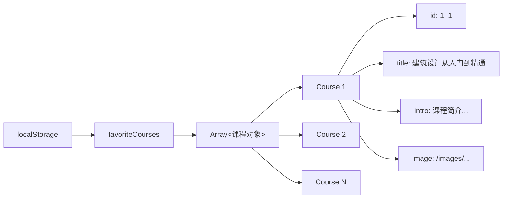

#### 收藏数据操作流程

| 操作类型 | 存储键名 | 数据格式 | 说明 |
|---------|---------|---------|------|
| **获取收藏** | 'favoriteCourses' | JSON字符串 → Array | `JSON.parse(localStorage.getItem('favoriteCourses'))` |
| **添加收藏** | 'favoriteCourses' | Array → JSON字符串 | 将课程对象添加到数组后存储 |
| **移除收藏** | 'favoriteCourses' | Array → JSON字符串 | 根据id过滤数组后重新存储 |
| **清空收藏** | 'favoriteCourses' | 空数组 | `localStorage.setItem('favoriteCourses', '[]')` |

#### 收藏数据示例

```json
[
  {
    "id": "1_1",
    "title": "建筑设计从入门到精通",
    "intro": "本课程系统介绍建筑设计的基础知识...",
    "image": "/images/index/建筑设计推广1.jpg"
  },
  {
    "id": "2_3",
    "title": "结构力学进阶",
    "intro": "深入学习结构力学的核心概念...",
    "image": "/images/index/结构设计推广3.jpg"
  }
]
```

### 4.4.3 数据流转关系

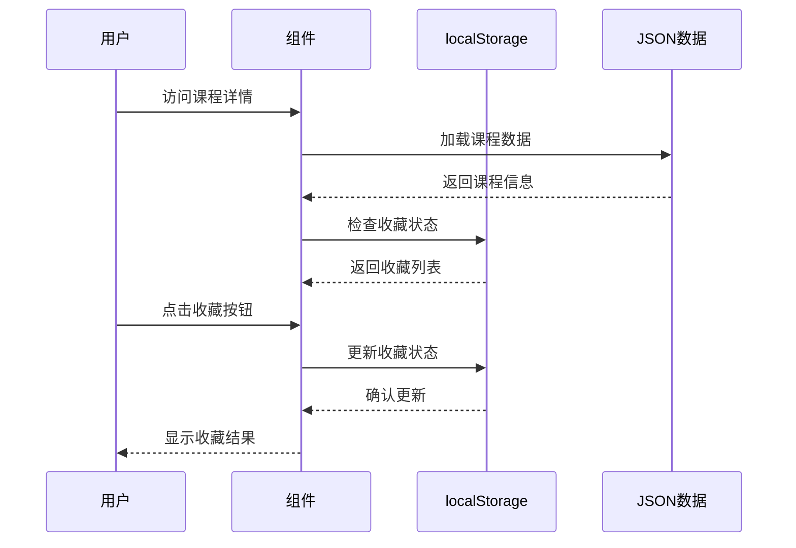

## 4.5 界面设计

系统界面设计遵循现代Web应用的设计原则，注重用户体验和视觉效果。

（1）颜色方案：采用蓝色系作为主色调，传达专业、可信赖的形象。辅助色采用中性色系，确保文本和背景的对比度。

（2）排版：标题采用较大字号和粗体，正文采用适中字号和常规字重，确保可读性。

（3）布局：采用网格布局和弹性布局相结合的方式，确保页面元素的合理排列和响应式适配。内容区域设置最大宽度，避免在大屏幕上过度拉伸，影响阅读体验。

（4）交互设计：添加适当的过渡动画和悬停效果，提升用户交互体验。按钮、链接等可交互元素设置明确的视觉反馈，帮助用户理解当前状态。

## 4.6 性能优化设计

为了提升系统的性能和用户体验，系统采用了以下优化策略：

（1）路由级代码分割：使用Vue Router的动态导入功能，实现路由级别的代码分割。每个页面组件在访问时才加载，减少初始包体积和首屏加载时间。

（2）静态资源优化：对页面中的图片进行适当的尺寸优化，使用合适的图片格式。通过合理的图片压缩减少文件大小，提升加载速度。

（3）本地数据缓存：对频繁使用的数据（如用户收藏状态）使用localStorage进行本地缓存，减少重复的数据处理操作。收藏状态在页面可见性变化时自动同步，确保数据一致性。

（4）CSS性能优化：使用CSS变量管理主题颜色，减少重复代码。采用合理的CSS选择器，避免过度嵌套影响渲染性能。使用CSS硬件加速属性提升动画性能。

（5）内存管理优化：合理管理定时器和事件监听器，在组件卸载时及时清理，避免内存泄漏。轮播图在页面不可见时自动暂停，减少不必要的资源消耗。

（6）响应式性能优化：使用CSS媒体查询实现响应式布局，避免JavaScript计算带来的性能开销。采用弹性布局和网格布局，确保在不同设备上的良好性能表现。

## 4.7 本章小结

本章详细设计了建筑行业资料电商式展示系统的各个方面，包括系统架构、页面结构、组件设计、数据模型、界面设计和性能优化。

系统采用前端单页应用架构，基于Vue3框架开发，使用Vue Router进行路由管理，Element Plus提供UI组件支持。系统架构分为界面层、业务逻辑层和数据层，各层职责明确，便于开发和维护。

页面结构设计遵循响应式原则，包含顶部导航栏、主内容区域和页脚。组件设计采用模块化思想，将系统功能拆分为多个独立的组件，提高代码的复用性和可维护性。数据模型设计合理，能够满足系统的功能需求。

界面设计注重用户体验和视觉效果，采用现代化的设计风格。性能优化设计考虑了多种优化策略，确保系统的响应速度和用户体验。

# 5 系统实现

## 5.1 图片轮播模块的实现

图片轮播模块是系统首页的重要组成部分，用于展示热门课程和推荐内容。该模块使用Vue的响应式系统和计算属性实现轮播功能，支持自动播放和手动控制。

轮播模块的核心实现包括以下几个部分：

（1）数据结构设计：轮播图数据采用多层嵌套数组结构，按专业分类存储每个专业的轮播图片信息。使用`currentSlideIndex`数组跟踪每个专业标签页的当前图片索引，使用`current`变量标识当前激活的专业标签页。

（2）自动播放功能：使用Vue的生命周期钩子（mounted和beforeUnmount）来管理定时器，实现图片的自动切换。定时器在组件挂载时启动，在组件卸载时清除，避免内存泄漏。同时监听页面可见性变化，页面不可见时暂停自动播放，可见时恢复播放。

（3）手动控制功能：提供左右切换按钮和指示器，用户可以手动控制轮播图的切换。点击控制按钮或指示器时会重置定时器，确保用户体验的流畅性。

（4）多标签页支持：系统支持5个专业标签页（建筑设计、结构设计、给排水设计、暖通设计、电气设计），每个标签页都有独立的轮播数据和状态管理。

（5）响应式设计：使用CSS的响应式属性，确保轮播图在不同屏幕尺寸下都能正常显示，在小屏幕设备上调整按钮和指示器的大小。

以下是轮播模块的核心代码实现：

```html
<div class="banner-swiper">
  <!-- 轮播图片 -->
  <div class="swiper-container">
    
  </div>
  <!-- 控制按钮 -->
  <button class="swiper-prev" @click="prevSlide">&lt;</button>
  <button class="swiper-next" @click="nextSlide">&gt;</button>
  <!-- 指示器 -->
  <div class="swiper-indicators">
    <span 
      v-for="(item, index) in currentSwiperList" 
      :key="index"
      :class="{ active: currentSlideIndex[current] === index }"
      @click="currentSlideIndex[current] = index"
    ></span>
  </div>
</div>
```

在JavaScript部分，轮播模块的数据和逻辑实现如下：

```javascript
export default {
  name: 'Home',
  data() {
    return {
      currentSlideIndex: [0, 0, 0, 0, 0],
      current: 0,
      // 轮播数据
      swiperLists: [
        [
          { image: '/images/index/建筑设计推广1.jpg', text: '建筑设计推广1' },
          { image: '/images/index/建筑设计推广2.jpg', text: '建筑设计推广2' },
          { image: '/images/index/建筑设计推广3.jpg', text: '建筑设计推广3' },
          { image: '/images/index/建筑设计推广4.jpg', text: '建筑设计推广4' }
        ],
//...其它专业信息
      ],
      swiperTimer: null,
    }
  },
  computed: {
    // 当前轮播数据
    currentSwiperList() {
      return this.swiperLists[this.current];
    }
  },
  methods: {
    startSwiper() {
      this.clearSwiperTimer();
      // 页面可见时创建定时器
      if (!document.hidden) {
        this.swiperTimer = setInterval(() => {
          this.currentSlideIndex[this.current] = (this.currentSlideIndex[this.current] + 1) % this.currentSwiperList.length;
        }, 3000);
      }
    },
    clearSwiperTimer() {
      if (this.swiperTimer) {
        clearInterval(this.swiperTimer);
        this.swiperTimer = null;
      }
    },
    // 重置定时器
    resetSwiperTimer() {
      this.startSwiper();
    },
    prevSlide() {
      this.currentSlideIndex[this.current] = (this.currentSlideIndex[this.current] - 1 + this.currentSwiperList.length) % this.currentSwiperList.length;
      this.resetSwiperTimer();
    },
    nextSlide() {
      this.currentSlideIndex[this.current] = (this.currentSlideIndex[this.current] + 1) % this.currentSwiperList.length;
      this.resetSwiperTimer();
    },
    // 页面可见性变化处理
    handleVisibilityChange() {
      if (document.hidden) {
        this.clearSwiperTimer();
      } else {
        this.startSwiper();
      }
    }
  },
  mounted() {
    this.startSwiper();
    // 添加事件监听
    document.addEventListener('visibilitychange', this.handleVisibilityChange);
  },
  beforeUnmount() {
    this.clearSwiperTimer();
    // 移除监听
    document.removeEventListener('visibilitychange', this.handleVisibilityChange);
  },
  watch: {
    current() {
      this.startSwiper();
    }
  }
}
```

轮播模块的样式设计注重视觉效果和响应式适配：

```css
/* 轮播图核心样式 - 省略常见的基础样式如position: relative、margin、border-radius等 */
.banner-swiper {
  height: 400px;
  overflow: hidden;
}

.swiper-container {
  width: 100%;
  height: 100%;
}

/* 轮播图片切换效果 - 省略position: absolute、top: 0、left: 0、width: 100%、height: 100%、object-fit: cover等基础定位属性 */
.banner-image {
  opacity: 0;
  transition: opacity 0.3s ease;
}

.banner-image.active {
  opacity: 1;
}

/* 控制按钮定位和交互 - 省略width、height、border、color、font-size、cursor、border-radius等常见外观样式 */
.swiper-prev,
.swiper-next {
  position: absolute;
  top: 50%;
  transform: translateY(-50%);
  background: rgba(0, 0, 0, 0.5);
  z-index: 10;
}

.swiper-prev { left: 20px; }
.swiper-next { right: 20px; }

/* 指示器布局 - 省略span标签的width、height、border-radius、background、cursor、transition等基础样式 */
.swiper-indicators {
  position: absolute;
  bottom: 20px;
  left: 50%;
  transform: translateX(-50%);
  display: flex;
  gap: 10px;
}

.swiper-indicators span.active {
  background: white;
}

/* 响应式适配 - 省略按钮尺寸、字体大小、指示器尺寸等移动端细节调整 */
@media (max-width: 768px) {
  .banner-swiper {
    height: 250px;
  }
  
  .swiper-prev { left: 10px; }
  .swiper-next { right: 10px; }
}
```

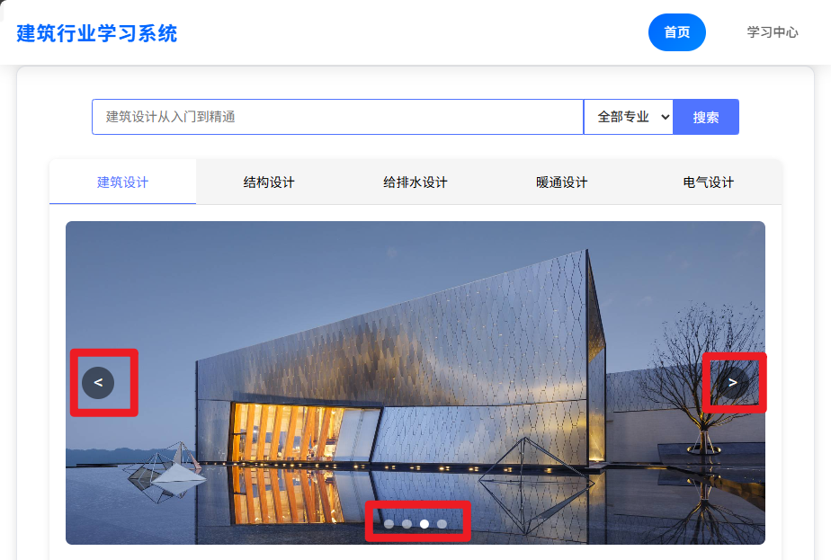

图5.1 轮播图片截图

## 5.2 课程信息模块的显示

课程信息模块是系统的核心功能之一，负责展示课程的概览信息和课程详情。该模块包括课程的概览信息展示和课程详情展示两个部分。

### 5.2.1 课程列表展示

课程列表的展示采用网格布局，每个课程卡片包含课程封面、标题和分类。

课程列表的界面实现使用了Element Plus的Card组件和网格布局：

```html
<!-- 课程列表区域 -->
<div class="courses-section">
  <h3 class="section-title">推荐课程</h3>
  <div class="courses-grid">
    <div 
      v-for="(item, index) in currentCourseList" 
      :key="index"
      class="course-card"
      @click="goCourse(current + 1, item.id)"
    >
      
      <h4 class="course-title">{{ item.title }}</h4>
      <span class="course-tag">{{ item.tag }}</span>
    </div>
  </div>
</div>
```

课程列表的数据获取逻辑如下：

以下为简化代码，方便演示数据加载流程。

```javascript
// 静态导入课程数据
import course1_1 from '../data/courses/1_1.json';
import course1_2 from '../data/courses/1_2.json';
import course1_3 from '../data/courses/1_3.json';
import course1_4 from '../data/courses/1_4.json';
// ... 其他课程数据导入

export default {
  name: 'Home',
  data() {
    return {
      current: 0,
      courseLists: [
        [
          { id: 1, title: '建筑设计从入门到精通' },
          { id: 2, title: '建筑结构设计原理' },
          // ... 更多课程
        ],
        // ... 其他专业课程列表
      ],
      // ... 其他数据
    };
  },
  methods: {
    // 加载课程数据
    loadCourseData() {
      const courseDataMap = {
        '1_1': course1_1,
        '1_2': course1_2,
        '1_3': course1_3,
        '1_4': course1_4,
        // ... 映射所有课程数据
      };
      
      // 遍历课程类型并合并数据
      for (let typeIndex = 0; typeIndex < this.courseLists.length; typeIndex++) {
        const courseType = typeIndex + 1;
        const courseList = this.courseLists[typeIndex];
        
        for (let courseIndex = 0; courseIndex < courseList.length; courseIndex++) {
          const courseId = courseList[courseIndex].id;
          const courseKey = `${courseType}_${courseId}`;
          
          if (courseDataMap[courseKey]) {
            this.courseLists[typeIndex][courseIndex].image = courseDataMap[courseKey].image;
            this.courseLists[typeIndex][courseIndex].tag = courseDataMap[courseKey].tag;
          }
        }
      }
    }
  },
  mounted() {
    this.loadCourseData();
  }
}
```

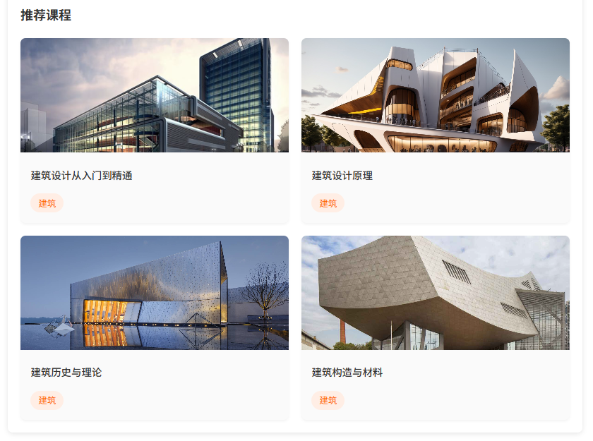

图5.2.1 课程列表的展示

### 5.2.2 课程详情展示

课程详情页面展示课程的完整信息，包括课程介绍、章节列表和视频内容。页面的核心功能是根据路由参数获取课程ID，通过静态导入的courseDataMap对象直接加载对应的课程数据。

课程详情的界面实现分为三个主要部分：
（1）课程基本信息：展示课程封面、标题、分类、简介和收藏按钮
（2）内容导航标签：提供"课程章节"和"课程介绍"两个标签页切换
（3）动态内容区域：根据选中的标签显示对应的章节列表或课程介绍

具体的HTML实现如下：

```html
<!-- 课程详情页面 -->
<div class="course-detail-page">
  <!-- 加载提示 -->
  <div v-if="!courseDetail" class="loading-container">
    <div class="loading-spinner"></div>
    <p>正在加载课程信息...</p>
  </div>
  
  <!-- 课程内容 -->
  <template v-else>
    <!-- 基本信息 -->
    <div class="course-header">
      <div class="course-main-info">
        <div class="course-cover">
          
        </div>
        <div class="course-info">
          <h4>{{ courseDetail.title }}</h4>
          <div class="course-meta">
            <span>{{ courseDetail.category }}</span>
          </div>
          <div v-html="courseDetail.intro"></div>
          <div class="course-actions">
            <button @click="addToFavorite">
              {{ isFavorite ? '已收藏' : '收藏' }}
            </button>
          </div>
        </div>
      </div>
    </div>

    <!-- 内容导航 -->
    <div class="course-nav">
      <div class="nav-tabs">
        <div 
          v-for="(tab, index) in tabs" 
          :key="index"
          :class="{ active: activeTab === index }"
          @click="activeTab = index"
        >
          {{ tab.name }}
        </div>
      </div>
    </div>

    <!-- 内容区域 -->
    <div class="course-content">
      <!-- 章节列表 -->
      <div v-if="activeTab === 0" class="course-chapters">
        <div 
          v-for="(chapter, chapterIndex) in courseDetail.chapters" 
          :key="chapterIndex"
          class="chapter"
        >
          <div class="chapter-header" @click="toggleChapter(chapterIndex)">
            <h3>
              <span>{{ chapterIndex + 1 }}</span>
              {{ chapter.title }}
            </h3>
            <div class="chapter-actions">
              <span>{{ chapter.sections.length }}小节</span>
              <span>{{ chapter.expanded ? '▼' : '▶' }}</span>
            </div>
          </div>
          <div v-if="chapter.expanded" class="chapter-sections">
            <div 
              v-for="(section, sectionIndex) in chapter.sections" 
              :key="sectionIndex"
              :class="{ active: section.isActive }"
              @click="goToSection(chapterIndex, sectionIndex)"
            >
              <div class="section-info">
                <span>{{ section.type }}</span>
                <span>{{ section.title }}</span>
              </div>
            </div>
          </div>
        </div>
      </div>

      <!-- 课程介绍 -->
      <div v-if="activeTab === 1" class="course-intro">
        <div v-html="courseDetail.intro"></div>
      </div>
    </div>
  </template>
</div>
```

为了支撑上述HTML模板的功能，需要通过Vue组件实现数据获取和展示逻辑。首先通过静态导入的方式加载课程数据，然后根据路由参数获取对应的课程信息，最后渲染到页面上。以下为简化代码，方便演示数据加载流程：

```javascript
// 静态导入课程数据
import course1_1 from '@/data/courses/1_1.json'
import course1_2 from '@/data/courses/1_2.json'
// ... 其他课程数据导入

// 课程数据映射
const courseDataMap = {
  '1_1': course1_1,
  '1_2': course1_2,
  // ... 映射所有课程数据
}

export default {
  name: 'CourseDetail',
  data() {
    return {
      activeTab: 0,
      isFavorite: false,
      tabs: [
        { name: '课程章节' },
        { name: '课程介绍' }
      ],
      courseDetail: null
    }
  },
  
  methods: {
    // 获取课程图片URL
    getCourseImageUrl() {
      const validCategories = ['建筑设计', '结构设计', '给排水设计', '暖通设计']
      const category = validCategories.includes(this.courseDetail.category) 
        ? this.courseDetail.category 
        : '电气设计'
      return `/images/index/${category}推广1.jpg`
    },
    
    // 更新收藏状态
    updateFavoriteStatus() {
      const favorites = JSON.parse(localStorage.getItem('favoriteCourses') || '[]')
      this.isFavorite = favorites.some(course => course.id === this.courseDetail.id)
    },
    
    // 收藏操作
    addToFavorite() {
      let favorites = JSON.parse(localStorage.getItem('favoriteCourses') || '[]')
      
      if (!this.isFavorite) {
        // 添加收藏
        const courseToAdd = {
          id: this.courseDetail.id,
          title: this.courseDetail.title,
          intro: this.courseDetail.intro,
          image: this.getCourseImageUrl()
        }
        favorites.push(courseToAdd)
        this.isFavorite = true
      } else {
        // 取消收藏
        favorites = favorites.filter(course => course.id !== this.courseDetail.id)
        this.isFavorite = false
      }
      
      localStorage.setItem('favoriteCourses', JSON.stringify(favorites))
    },
    
    // 切换章节展开状态
    toggleChapter(index) {
      this.courseDetail.chapters[index].expanded = !this.courseDetail.chapters[index].expanded
    },
    
    // 跳转到指定小节
    goToSection(chapterIndex, sectionIndex) {
      // 重置所有小节的活跃状态
      this.courseDetail.chapters.forEach(chapter => {
        chapter.sections.forEach(section => {
          section.isActive = false
        })
      })
      // 设置当前小节为活跃状态
      this.courseDetail.chapters[chapterIndex].sections[sectionIndex].isActive = true
    }
  },
  mounted() {
    // 从路由参数获取课程ID
    const courseId = this.$route.params.id || '1_1'
    
    // 直接从映射中获取课程数据
    this.courseDetail = courseDataMap[courseId] || courseDataMap['1_1']
    
    // 初始化收藏状态
    this.updateFavoriteStatus()
  }
}
```

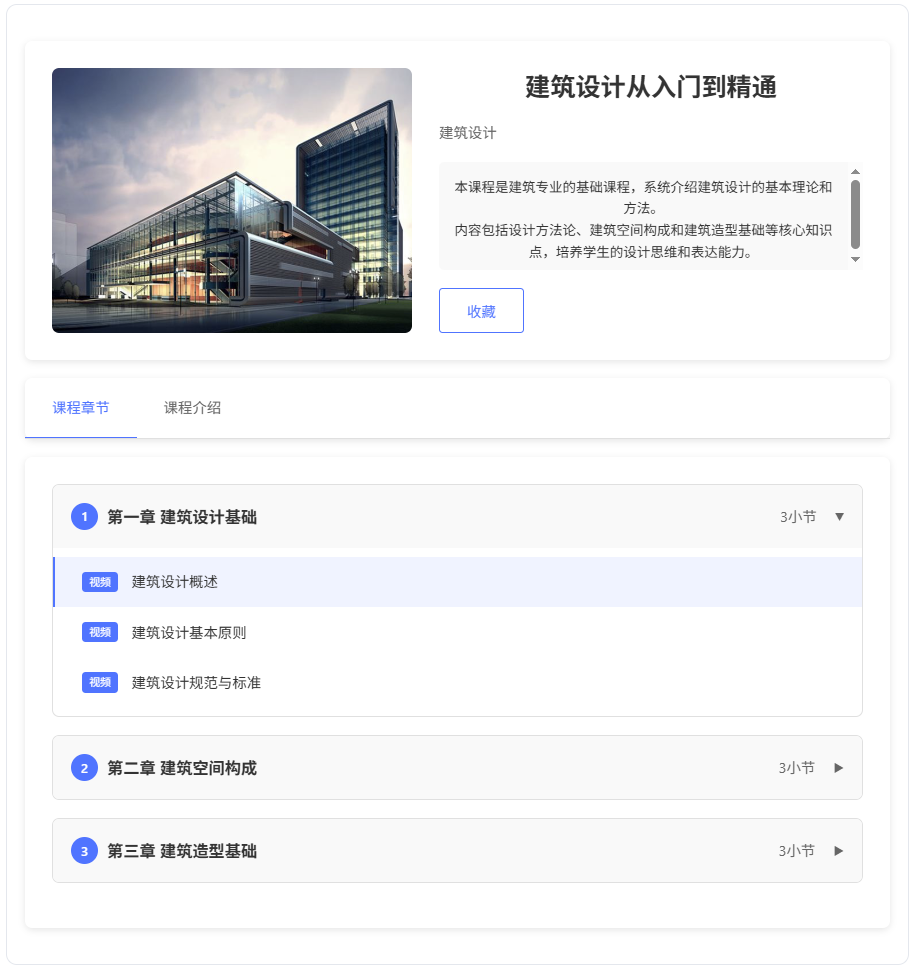

图5.2.2-1 课程详情展示

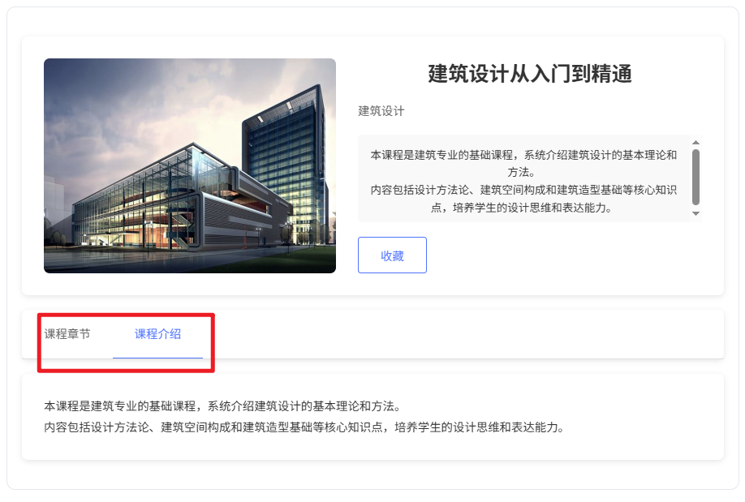

图5.2.2-2 课程介绍展示

## 5.3 课程信息搜索模块的实现

搜索模块是系统的重要功能，帮助用户快速找到所需的课程。搜索功能支持关键词搜索和条件筛选。

搜索模块的核心功能包括：

（1）关键词搜索：根据用户输入的关键词，在课程标题中进行匹配。

（2）手动搜索：用户输入关键词后需要点击搜索按钮或按回车键触发搜索，避免频繁的搜索操作影响性能。

（3）分类筛选：提供专业分类下拉选择，支持按建筑、结构、给排水、暖通、电气等专业进行筛选。

（4）搜索结果展示：以卡片形式展示搜索结果，包含课程图片、标题和标签信息。


搜索模块的实现逻辑如下：

以下为简化代码，方便演示数据加载流程：

```html
<!-- 搜索栏 -->
<div class="search-section">
  <div class="search-box">
    <input 
      type="text" 
      placeholder="建筑设计从入门到精通" 
      v-model="keyword"
      class="search-input"
      @keyup.enter="searchCourses"
    >
    <select v-model="selectedMajor" class="major-select">
      <option value="0">全部专业</option>
      <option value="1">建筑</option>
      <option value="2">结构</option>
      <option value="3">给排水</option>
      <option value="4">暖通</option>
      <option value="5">电气</option>
    </select>
    <button class="search-btn" @click="searchCourses">搜索</button>
  </div>
</div>
<!-- 搜索结果区域 -->
<div v-if="showSearchResults && searchResults.length > 0" class="search-results">
  <h3 class="section-title">搜索结果</h3>
  <div class="courses-grid">
    <div 
      v-for="(item, index) in searchResults" 
      :key="index"
      class="course-card"
      @click="goCourse(item.type, item.id)"
    >
      
      <h4 class="course-title">{{ item.title }}</h4>
      <span class="course-tag">{{ item.tag }}</span>
    </div>
  </div>
</div>
<!-- 无搜索结果提示 -->
<div v-else-if="showSearchResults && searchResults.length === 0" class="no-results">
  <p>未找到相关课程，请尝试其他关键词</p>
</div>
```

搜索功能的JavaScript实现如下：

```javascript
export default {
  name: 'Home',
  data() {
    return {
      keyword: '',
      selectedMajor: '0', // 0表示全部专业
      showSearchResults: false,
      searchResults: [],
      courseLists: [
        // 建筑设计专业课程（4门基础课程）
        [
          { id: 1, title: '建筑设计从入门到精通' },
          { id: 2, title: '建筑设计原理' },
          { id: 3, title: '建筑历史与理论' },
          { id: 4, title: '建筑构造与材料' }
        ],
        // ...其他专业课程结构类似
      ]
    };
  },
  methods: {
    // 搜索课程
    searchCourses() {
      if (!this.keyword.trim()) {
        this.showSearchResults = false;
        this.current = 0; // 重置到建筑设计标签页
        return;
      }
      
      // 重置搜索结果
      this.searchResults = [];
      
      // 遍历所有专业的所有课程进行搜索
      for (let typeIndex = 0; typeIndex < this.courseLists.length; typeIndex++) {
        const courseType = typeIndex + 1; // 类型编号从1开始
        
        // 筛选专业
        if (this.selectedMajor !== '0' && parseInt(this.selectedMajor) !== courseType) {
          continue;
        }
        
        const courseList = this.courseLists[typeIndex];
        
        // 筛选课程
        const matchedCourses = courseList.filter(course => 
          course.title.includes(this.keyword)
        );
        
        // 添加到结果
        matchedCourses.forEach(course => {
          this.searchResults.push({
            ...course,
            type: courseType
          });
        });
      }
      
      this.showSearchResults = true;
    },
    
    // 重置页面
    resetToHomeTab() {
      this.current = 0; // 建筑设计标签的索引
      this.showSearchResults = false; // 隐藏搜索结果
      this.keyword = ''; // 清空搜索关键词
      this.selectedMajor = '0'; // 重置到全部专业
      this.searchResults = []; // 清空搜索结果数组
    },
    
    // 跳转到课程详情
    goCourse(type, id) {
      this.$router.push({
        path: `/course/${type}_${id}`
      });
    }
  }
}
```

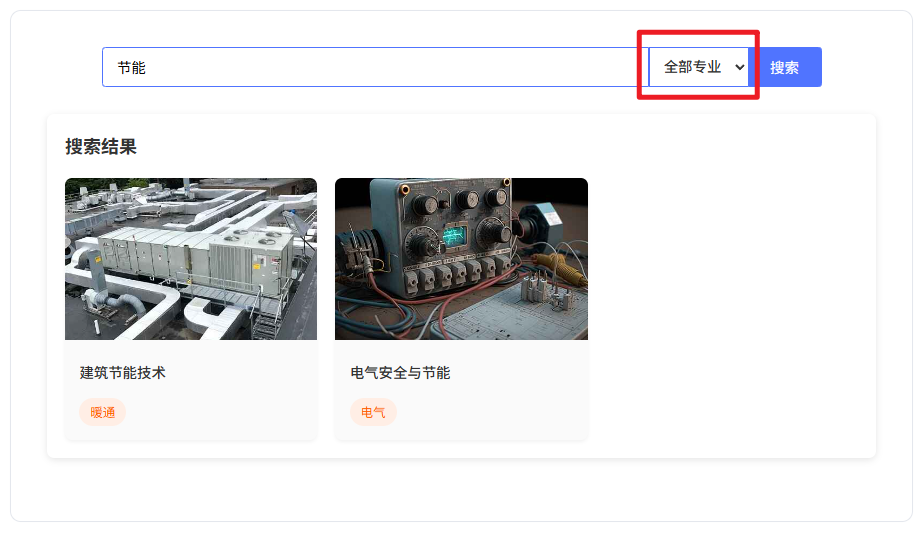

图5.3-1 搜索模块的展示图一

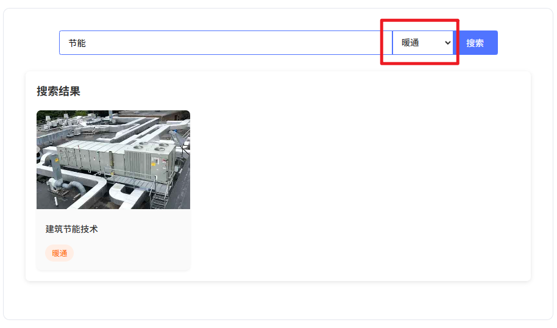

图5.3-2 搜索模块的展示图二

## 5.4 课程收藏与取消收藏的实现

收藏功能允许用户保存感兴趣的课程，方便后续查看和学习。该功能使用浏览器的localStorage存储用户的收藏状态，实现数据的持久化。

收藏功能的核心实现包括：

（1）收藏状态管理：在不同页面采用不同的状态管理策略，Learn页面使用Vue的watch监听器自动同步数据，CourseDetail页面调用localStorage；

（2）收藏状态切换：提供收藏/取消收藏按钮，实现状态的快速切换；

（3）收藏列表展示：在Learn页面展示用户收藏的所有课程。

关于双向绑定的实现：

（1）Learn页面：使用watch监听器实现`favoriteCourses`数组的自动持久化，当数据变化时自动保存到localStorage；

（2）CourseDetail页面：采用手动调用localStorage的方式，在收藏操作完成后立即保存数据；

（3）跨页面同步：通过visibilitychange事件确保多标签页间的数据一致性。

收藏功能的实现逻辑如下：

以下为简化代码，方便演示数据加载流程：

收藏功能的界面实现与课程列表类似，但增加了取消收藏的功能：

```html
<!-- 收藏课程列表（双向绑定的数据→视图展示） -->
<div class="course-list" v-if="favoriteCourses.length">
  <div 
    class="course-item" 
    v-for="(course, index) in favoriteCourses" 
    :key="course.id"
    @click="goCourse(course.id)"
  >
    
    <div class="course-info">
      <h3 class="course-title">{{ course.title }}</h3>
      <p class="course-desc">{{ course.description }}</p>
    </div>
    <button class="favorite-btn" @click.stop="toggleFavorite(course)">
      <span class="star-icon">★</span>
    </button>
  </div>
</div>

<!-- 无收藏内容 -->
<div v-else class="empty-state">
  <p>暂无收藏课程</p>
</div>
```

收藏功能的JavaScript实现如下：

```javascript
export default {
  name: 'Learn',
  data() {
    return {
      favoriteCourses: []
    }
  },
  created() {
    // 加载收藏
    this.loadFavorites()
  },
  mounted() {
    // 监听可见性变化
    document.addEventListener('visibilitychange', this.handleVisibilityChange)
  },
  beforeDestroy() {
    document.removeEventListener('visibilitychange', this.handleVisibilityChange)
  },
  watch: {
    // 监听收藏变化
    favoriteCourses: {
      handler(newVal) {
        localStorage.setItem('favoriteCourses', JSON.stringify(newVal))
      },
      deep: true
    }
  },
  methods: {
    // 获取课程图片URL
    getCourseImageUrl(title) {
      // 专业关键词映射
      const courseTypeMap = [
        { keywords: ['建筑设计'], type: '建筑设计' },
        { keywords: ['力学', '混凝土', '钢结构', '地基'], type: '结构设计' },
        { keywords: ['给排水', '给水', '排水', '水质'], type: '给排水设计' },
        { keywords: ['暖通', '空调', '通风', '制冷', '建筑节能'], type: '暖通设计' },
        { keywords: ['供配电', '照明', '智能化', '电气'], type: '电气设计' }
      ];
      
      // 查找匹配类型
      const foundType = courseTypeMap.find(item => 
        item.keywords.some(keyword => title.includes(keyword))
      );
      
      // 返回对应图片
      const courseType = foundType ? foundType.type : '建筑设计';
      return `/images/index/${courseType}推广1.jpg`;
    },
    
    // 跳转到课程详情
    goCourse(id) {
      this.$router.push({
        path: `/course/${id}`
      })
    },
    
    // 加载收藏列表
    loadFavorites() {
      const favorites = localStorage.getItem('favoriteCourses')
      if (favorites) {
        this.favoriteCourses = JSON.parse(favorites)
      }
    },
    
    // 取消收藏（双向绑定的视图→数据操作）
    toggleFavorite(course) {
      const index = this.favoriteCourses.findIndex(item => item.id === course.id)
      if (index !== -1) {
        // 直接修改响应式数组，触发视图更新
        this.favoriteCourses.splice(index, 1)
      }
    },
    
    // 页面可见性处理
    handleVisibilityChange() {
      if (!document.hidden) {
        // 页面可见时重新加载收藏数据
        this.loadFavorites()
      }
    }
  }
}
```

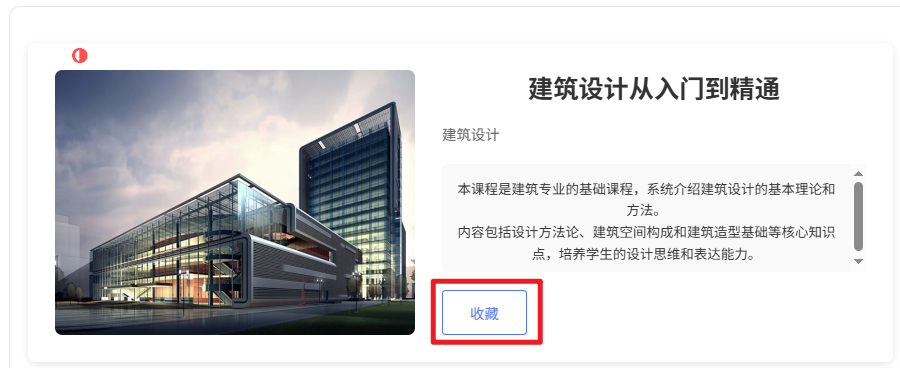

图5.4-1 课程收藏图一（点击收藏前）

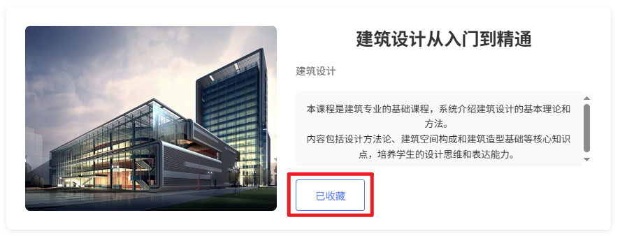

图5.4-2 课程收藏图二（点击收藏后）

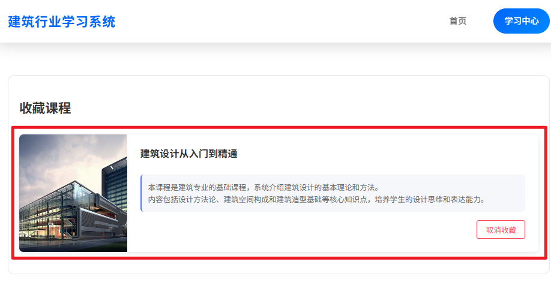

图5.4-3 课程收藏图三（学习中心的展示，可对课程进行取消收藏）

## 5.5 在json文件中添加课程的实现

课程数据管理是系统的重要功能，管理员需要能够方便地添加、编辑和删除课程信息。在本系统中，课程数据以JSON文件形式存储，每个课程对应一个独立的JSON文件。

JSON数据文件的结构设计如下：

```json
{
  "id": "1_1",
  "title": "建筑设计从入门到精通",
  "category": "建筑设计",
  "image": "/images/index/建筑设计推广1.jpg",
  "tag": "建筑",
  "chapters": [
    {
      "title": "第一章 建筑设计基础",
      "expanded": true,
      "sections": [
        {
          "type": "视频",
          "title": "建筑设计概述",
          "isActive": true
        },
        {
          "type": "视频",
          "title": "建筑设计基本原则",
          "isActive": false
        }
      ]
    }
  ],
  "intro": "<p>本课程是建筑专业的基础课程，系统介绍建筑设计的基本理论和方法。</p>"
}
```

为了方便管理员添加课程，系统提供了一个简单的数据模板。管理员可以基于该模板，创建新的JSON文件并添加到courses目录中。系统在启动时会自动加载这些JSON文件，并在界面上展示课程信息。

在该实际应用中，后续还可以进一步开发一个管理界面，允许管理员通过图形界面添加、编辑和删除课程数据，而无需直接在存放JSON文件的文件夹中对JSON文件进行操作。但是目前，我们采用了文件系统的方式存储课程数据，是为了便于开发和维护。

## 5.6 本章小结

本章详细描述了建筑行业资料电商式展示系统的实现过程，包括图片轮播模块、课程信息模块、搜索模块、收藏功能和课程数据管理等核心功能的实现。

系统使用Vue3框架和Element Plus组件库开发，采用模块化的设计思想，将系统功能拆分为多个独立的组件。数据存储采用JSON文件格式，用户的收藏状态保存在localStorage中。

图片轮播模块实现了自动播放和手动控制功能，支持响应式设计。课程信息模块实现了课程列表展示和课程详情展示，提供了丰富的课程信息和交互功能。搜索模块支持关键词搜索和条件筛选，帮助用户快速找到所需的课程。收藏功能允许用户保存感兴趣的课程，方便后续查看和学习。课程数据管理采用JSON文件存储，便于数据的维护和更新。

通过本章的实现，系统的核心功能已经完成，能够满足用户浏览、搜索、收藏和学习建筑行业资料的需求。

# 6 结论与展望

## 6.1 研究成果

本课题成功设计并实现了一个面向建筑行业资料的电商式展示系统。整个系统基于Vue3框架和Element Plus组件库开发，不仅具有良好的用户界面，交互体验也相当不错。通过本课题的研究，取得了一些有价值的成果。

首先在系统架构设计方面，设计了基于前端单页应用的系统架构，包括界面层、业务逻辑层和数据层，各层职责明确，这样开发和维护起来都比较方便。其次在核心功能实现上，成功实现了图片轮播、课程展示、搜索筛选、收藏管理等核心功能，基本满足了用户浏览、搜索、收藏和学习建筑行业资料的需求。数据模型设计方面，设计了合理的JSON数据结构来存储课程信息，支持课程详情展示和动态更新。最后在用户体验优化方面，采用了响应式设计，确保系统在不同设备上都能提供良好的用户体验，还添加了适当的过渡动画和交互效果来提升用户体验。

## 6.2 不足与改进方向

尽管系统已经实现了主要功能，但说实话还是存在一些不足和可以改进的地方。

在数据管理方式上，当前系统使用JSON文件存储课程数据，这对于小型应用来说还算合适，但如果要处理大规模数据的话，效率就不够高了。未来可以考虑使用数据库来存储课程数据，这样能提高数据管理的效率和安全性。另外用户系统这块目前还是个空白，没有实现用户注册、登录和权限管理功能。如果时间允许的话，可以添加用户系统，实现个性化推荐和学习进度追踪这些实用的功能。

视频播放功能目前预留了接口扩展，为未来集成专业的视频播放器提供了基础。这个功能对在线学习平台很重要，未来可以支持视频的在线播放和学习进度记录。搜索功能也有优化空间，现在只支持简单的关键词匹配，可以进一步优化搜索算法，实现语义搜索和模糊匹配，这样搜索的准确性和用户体验都会好很多。最后是性能优化方面，对于大量课程数据的加载，还可以进一步优化，比如采用分页加载或虚拟滚动这些技术，提高页面加载速度和响应性能。

## 6.3 未来展望

随着建筑行业数字化转型的深入推进，建筑行业资料的电商式展示系统具有广阔的应用前景。未来，系统可以在以下方面进一步发展：

在多平台支持方面，可以开发移动端应用，实现多平台数据同步，这样用户就能随时随地学习和查询资料了。智能化推荐也是个不错的方向，引入机器学习算法，根据用户的学习历史和偏好，提供个性化的课程推荐，这样能显著提高学习效率。

社区功能也很重要，可以添加用户评论、讨论和分享功能，构建学习社区，促进用户之间的交流和知识共享。数据分析这块也不能忽视，通过收集和分析用户行为数据，可以为系统优化和内容更新提供有力的数据支持。最后还可以考虑提供开放API，允许第三方应用集成系统功能，这样就能扩展系统的应用场景和影响力。

总的来说，面向建筑行业资料的电商式展示系统具有重要的实用价值和发展潜力。通过不断的优化和完善，系统可以为建筑行业的数字化转型提供有力支持，促进建筑行业知识的传播和共享。

# 参考文献

[1] 张思民. Vue.js实战[M]. 北京: 机械工业出版社, 2020.

[2] 李刚. 前端工程化实践[M]. 北京: 电子工业出版社, 2021.

[3] 王华. 响应式Web设计[M]. 北京: 人民邮电出版社, 2019.

[4] 张明. 建筑行业信息化发展趋势研究[J]. 建筑技术, 2022, 53(10): 1245-1248.

[5] 李红. 基于Web的建筑资料管理系统设计与实现[D]. 西安: 西安建筑科技大学, 2021.

[6] 赵强. 电商平台用户体验设计研究[J]. 设计学报, 2020, 5(3): 45-52.

[7] 刘芳. JSON数据格式在Web应用中的应用[J]. 计算机工程与应用, 2019, 55(20): 123-127.

[8] 陈静. Vue3.0新特性解析[J]. 前端开发技术, 2021, 10(4): 34-38.

[9] 王建国. 建筑行业知识管理系统设计[J]. 建筑科学, 2022, 38(6): 156-160.

[10] 刘强. Web前端性能优化策略研究[J]. 计算机应用研究, 2020, 37(8): 2456-2459.